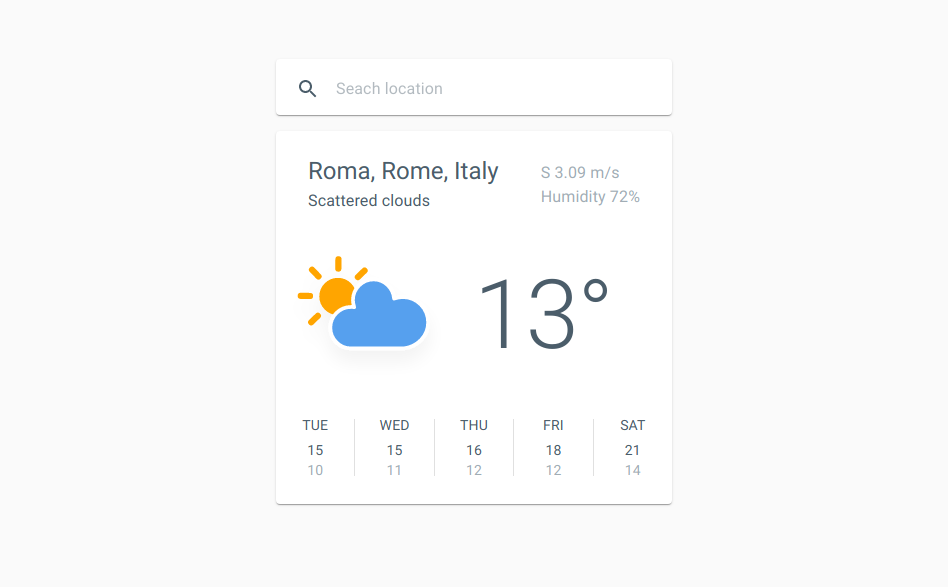

# Weather Forecast app

Simple React application that displays weather forecast for next 5 days.
Features a search bar and clean Material Design UI.

## Demo

App is hosted on GitHub Pages 
[https://egorgrodno.github.io/weather-forecast/]

## Features

- **IO validation:** everything nondeterministic has to be verified; for
  example: the API can change over time and application has to properly react to
  that by raising an error during validation stage
- **Fully typed:** every variable or function has a type assigned to it (either
  inferred or manually declared) and it is **never** `any`
- **API integration:** the application is seamlessly integrated with
  [OpenWeather] and [Mapbox] APIs
- **[RemoteData]:** HTTP request result is modeled with an algebraic data type
  that handles all possible states
- **[Store]:** single centralized state (simpler alternative to Redux)
- **Immutable & functional codebase:** the application makes heavy use of
  popular functional patterns and abstractions and never mutates any data

[https://egorgrodno.github.io/weather-forecast/]: https://egorgrodno.github.io/weather-forecast/
[OpenWeather]: https://openweathermap.org/
[Mapbox]: https://www.mapbox.com/
[RemoteData]: ./src/lib/RemoteData.ts
[Store]: ./src/lib/Store.ts
